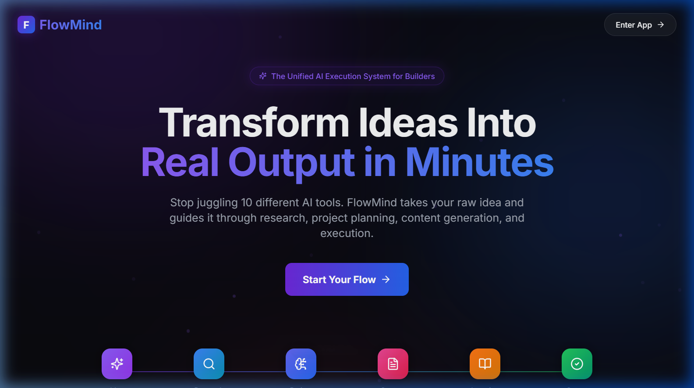
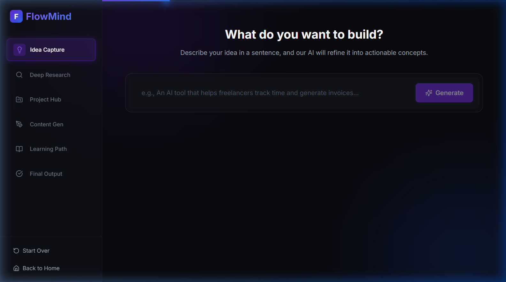
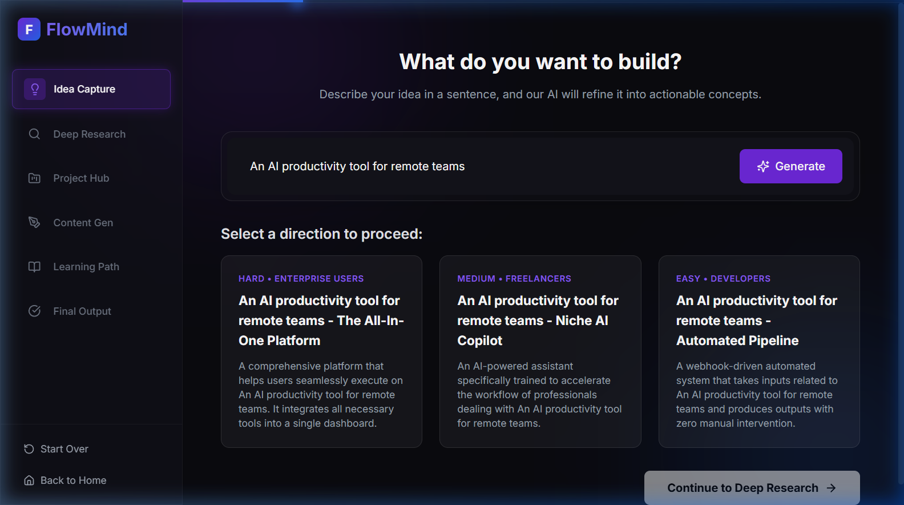

# FlowMind AI 🧠⚡
### Unified AI Execution System — Transform Ideas Into Real Output in Minutes

[](LICENSE)
[](https://nodejs.org)
[](https://vitejs.dev)

---

## � Screenshots

### 🏠 Landing Page


### 🧭 Dashboard — Idea Capture (Step 1)


### 💡 AI-Generated Idea Refinements


---

## �🚀 What is FlowMind AI?

FlowMind AI is a full-stack SaaS prototype that guides you through a **6-step AI pipeline** — from a raw idea all the way to a fully fleshed-out execution strategy, marketing content, and learning roadmap.

> Stop juggling 10 different AI tools. FlowMind does it all in one unified flow.

---

## ✨ Features

- **Step 1 — Idea Capture**: Enter your raw idea, get 3 AI-refined directional concepts
- **Step 2 — Deep Research**: Market trends, demographics, competitor analysis, revenue models & KPIs
- **Step 3 — Project Hub**: Editable problem statement, solution, and 5-step execution blueprint
- **Step 4 — Content Generation**: LinkedIn posts, Instagram captions & viral hook variations
- **Step 5 — Learning Path**: A personalized 14-day execution roadmap
- **Step 6 — Final Output**: Download-ready PDF pack and shareable link

---

## 🛠️ Tech Stack

| Layer | Technology |
|---|---|
| Frontend | React 18, Vite, Tailwind CSS, Framer Motion |
| State Management | Zustand (with LocalStorage persistence) |
| Routing | React Router v7 |
| Backend | Node.js + Express |
| Icons | Lucide React |

---

## 📁 Project Structure

```
flowmind-ai/
├── backend/
│   ├── server.js          # Express entry point
│   └── routes/
│       └── api.js         # All 5 AI pipeline endpoints
└── frontend/
    ├── src/
    │   ├── pages/         # LandingPage & WizardContainer
    │   ├── components/    # Sidebar, Pipeline Steps (1-6), UI
    │   └── store/         # Zustand global state
    ├── tailwind.config.js
    └── vite.config.js
```

---

## ⚙️ Local Setup

### 1. Clone the repository
```bash
git clone https://github.com/Student-Abhishekkumar/FlowMind.git
cd FlowMind
```

### 2. Start the Backend
```bash
cd backend
npm install
node server.js
# Runs on http://localhost:5000
```

### 3. Start the Frontend
```bash
cd frontend
npm install
npm run dev
# Runs on http://localhost:5173
```

---

## 🤝 Contributing

Pull requests are welcome! For major changes, please open an issue first.

---

## 📄 License

This project is licensed under the [MIT License](LICENSE).

---

Made with ❤️ by [Abhishek Kumar](https://github.com/Student-Abhishekkumar)
